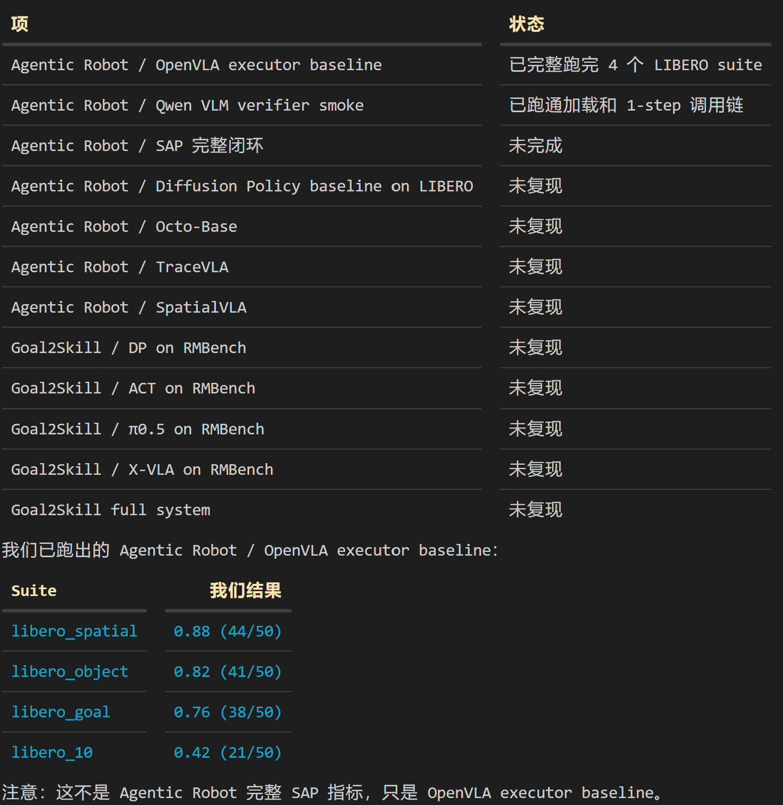
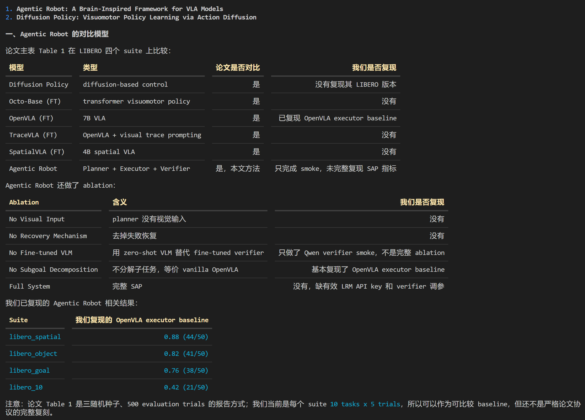
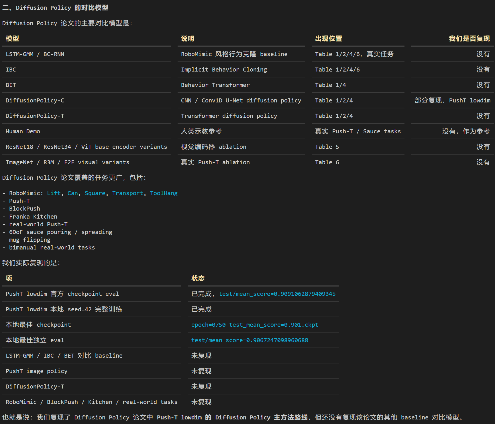

# 复现结果总汇

日期：2026-07-05

</br>

</br>

</br>

</br>


</br>

</br>


本文档汇总 `/renyuanliu/MDE-research/Agentic Robot/复现` 下当前已经完成的复现结果。详细命令、日志路径和环境恢复步骤见各子目录 README：

- `agentic_robot_libero/README.md`
- `libero_diffusion_policy/README.md`

## 1. 总体状态

| 复现线 | 当前状态 | 可汇报 baseline |
|---|---|---|
| Agentic Robot / LIBERO | OpenVLA executor baseline 已完整完成；SAP / VLM verifier 只完成 smoke 和单任务对照 | 4 个 LIBERO suite，均为 10 tasks x 5 trials |
| Diffusion Policy / PushT lowdim | 官方 checkpoint eval、本地 seed=42 完整训练、top checkpoint 独立 eval 均已完成 | 官方 checkpoint `0.9091062879409345`；本地最佳 `0.9067247098960688` |

当前可以正式汇报的 baseline：

1. Agentic Robot 的 OpenVLA executor baseline。
2. Diffusion Policy 的 PushT lowdim baseline。

当前还不能声称完成的内容：

1. Agentic Robot 论文完整 SAP / Planner-Executor-Verifier 指标。
2. Diffusion Policy 的多 seed 论文级统计。
3. Diffusion Policy 接 LIBERO 的策略训练或评估。

## 2. 环境与复现资产

已恢复并验证的 conda 环境：

| 环境 | 用途 |
|---|---|
| `ar_agentic_libero` | Agentic Robot / LIBERO 的 OpenVLA executor baseline |
| `ar_agentic_libero_vlm` | Qwen2.5-VL verifier / SAP smoke，不用于纯 OpenVLA baseline |
| `ar_pusht_dp` | Diffusion Policy / PushT lowdim 训练与评估 |

已保留的环境导出：

| 文件 | 说明 |
|---|---|
| `agentic_robot_libero/environment_ar_agentic_libero.yml` | OpenVLA executor 环境导出 |
| `agentic_robot_libero/pip_freeze_ar_agentic_libero.txt` | OpenVLA executor pip freeze |
| `agentic_robot_libero/environment_ar_agentic_libero_vlm.yml` | VLM verifier 环境导出 |
| `agentic_robot_libero/pip_freeze_ar_agentic_libero_vlm.txt` | VLM verifier pip freeze |
| `libero_diffusion_policy/environment_ar_pusht_dp.yml` | PushT / Diffusion Policy 环境导出 |
| `libero_diffusion_policy/pip_freeze_ar_pusht_dp.txt` | PushT / Diffusion Policy pip freeze |

注意：这些环境导出不是都适合直接 `conda env create -f`。环境删除后的恢复命令已分别写在两个 README 中。

## 3. Agentic Robot / LIBERO

### 3.1 代码与基础验证

| 项 | 结果 |
|---|---|
| 上游仓库 | `Agentic-Robot/agentic-robot` |
| commit | `cafb8d5` |
| LIBERO 仿真 smoke | 通过，`libero_spatial` task 0 reset / render / dummy action step 正常 |
| OpenVLA 7B 最小 smoke | 通过，模型加载和 1-step 推理链路正常，按预期 timeout |
| 本地 patch | 已把 planner / verifier 做成显式可配置开关；默认仍保持纯 OpenVLA executor baseline 行为 |

patch 文件：

```text
agentic_robot_libero/patches/agentic_robot_main_smoke.patch
```

### 3.2 OpenVLA executor baseline 总分

配置均为：

- `--num_trials_per_task 5`
- 10 tasks
- 不启用 VLM verifier
- `save_frames=False`

| Suite | 模型 | 成功率 | 成功数 | 耗时 |
|---|---|---:|---:|---:|
| `libero_spatial` | `openvla/openvla-7b-finetuned-libero-spatial` | `0.88` | `44/50` | `2551.87s` |
| `libero_object` | `openvla/openvla-7b-finetuned-libero-object` | `0.82` | `41/50` | `2995.33s` |
| `libero_goal` | `openvla/openvla-7b-finetuned-libero-goal` | `0.76` | `38/50` | `2978.27s` |
| `libero_10` | `openvla/openvla-7b-finetuned-libero-10` | `0.42` | `21/50` | `6285.14s` |

### 3.3 OpenVLA executor baseline 逐 task 结果

| Suite | task_id 成功数 |
|---|---|
| `libero_spatial` | `0:5/5`, `1:5/5`, `2:4/5`, `3:4/5`, `4:3/5`, `5:5/5`, `6:5/5`, `7:5/5`, `8:3/5`, `9:5/5` |
| `libero_object` | `0:3/5`, `1:4/5`, `2:4/5`, `3:3/5`, `4:4/5`, `5:4/5`, `6:4/5`, `7:5/5`, `8:5/5`, `9:5/5` |
| `libero_goal` | `0:2/5`, `1:5/5`, `2:5/5`, `3:3/5`, `4:5/5`, `5:1/5`, `6:3/5`, `7:5/5`, `8:5/5`, `9:4/5` |
| `libero_10` | `0:2/5`, `1:4/5`, `2:2/5`, `3:2/5`, `4:1/5`, `5:4/5`, `6:2/5`, `7:2/5`, `8:2/5`, `9:0/5` |

完整日志：

```text
agentic_robot_libero/data/logs/PEV_V1-EVAL-libero_spatial-openvla-2026_07_04-18_09_46--full_executor_baseline_5trials.txt
agentic_robot_libero/data/logs/PEV_V1-EVAL-libero_object-openvla-2026_07_04-19_55_12--full_executor_baseline_5trials.txt
agentic_robot_libero/data/logs/PEV_V1-EVAL-libero_goal-openvla-2026_07_04-20_46_45--full_executor_baseline_5trials.txt
agentic_robot_libero/data/logs/PEV_V1-EVAL-libero_10-openvla-2026_07_04-21_37_39--full_executor_baseline_5trials.txt
```

### 3.4 VLM verifier / SAP 进展

已完成：

| 项 | 结果 |
|---|---|
| 独立 VLM 环境 | `ar_agentic_libero_vlm` 已创建 |
| Qwen verifier 模型 | `Qwen/Qwen2.5-VL-3B-Instruct` 已缓存并能加载 |
| `manual_plan + Qwen verifier + OpenVLA executor` 1-step smoke | 调用链跑通；Qwen verifier 在 `t=10` 被调用并返回 `Not Complete`；episode 按预期 timeout |
| 原始 task 指令 + verifier 关闭 | `libero_spatial` task 0，`1/1` 成功 |
| 原始 task 指令 + verifier 开启 | `libero_spatial` task 0，`1/1` 成功 |
| 手写 `pick/place` plan + verifier 开启 | `libero_spatial` task 0，`0/1` |
| 手写 `pick/place` plan + `vlm_history_length=5` + `verify_frequency=10` | `libero_spatial` task 0，`0/1` |
| LRM planner API key smoke | 当前 `OPENAI_API_KEY` 对 `https://api.openai.com/v1` 返回 401；fallback 路径验证通过 |

结论：

1. 新版 `transformers` 的 VLM 环境没有破坏 OpenVLA executor 对原始任务指令的执行。
2. 当前失败来自朴素手写 plan / verifier 判断策略，而不是 OpenVLA executor 本身。
3. 当前结果不能代表论文完整 SAP 指标。

### 3.5 Agentic Robot 尚未完成项

| 缺口 | 说明 |
|---|---|
| 有效 LRM API key | 需要 `DASHSCOPE_API_KEY` 或等价 LRM 接口 key，用于批量生成 task-level plan |
| SAP ablation | 还需要在指定 suite 或 task 上跑 planner / executor / verifier 闭环对比 |
| verifier prompt | 当前 prompt 对 `pick up` 完成条件可能过严，导致对象已被放下后仍判定 pick 未完成 |
| 子任务粒度 | 朴素 `pick/place` 分解在 `libero_spatial` task 0 上从 `1/1` 回退到 `0/1`，不能直接用于论文指标 |

## 4. Diffusion Policy / PushT Lowdim

### 4.1 代码与基础验证

| 项 | 结果 |
|---|---|
| Diffusion Policy 仓库 | `repos/diffusion_policy` |
| Diffusion Policy commit | `5ba07ac` |
| LIBERO 仓库 | `repos/LIBERO` |
| LIBERO commit | `8f1084e` |
| PushT 数据 | 已下载并可读取 |
| Dataset 读取 | `dataset_len 10726`，obs shape `[16, 20]`，action shape `[16, 2]` |
| CPU smoke train/eval | 通过 |
| GPU smoke train | 通过 |

### 4.2 本地 PushT lowdim 完整训练

训练配置：

| 项 | 值 |
|---|---|
| config | `train_diffusion_unet_lowdim_workspace` |
| seed | `42` |
| device | `cuda:0` |
| 输出目录 | `libero_diffusion_policy/repos/diffusion_policy/data/outputs/pusht_lowdim_full_seed42_gpu_20260704` |

训练说明：

初次训练曾在 epoch 1028 左右中断。环境恢复后，从 `latest.ckpt` 的 epoch 1000 继续补跑 `training.num_epochs=4000` 个本地 epoch。官方 workspace 的 resume 逻辑会从 checkpoint 中的 `self.epoch` 继续累加，因此完整跑到 epoch 5000 的保存节奏；脚本最后保存的 `latest.ckpt` 为 epoch 4950。

完整训练后 checkpoint 元数据：

| 项 | 值 |
|---|---:|
| `latest.ckpt global_step` | `207982` |
| `latest.ckpt epoch` | `4950` |

训练时在线 rollout：

| 指标 | 值 |
|---|---:|
| 最佳 epoch | `2350` |
| 最佳 `test/mean_score` | `0.9057693529859826` |
| 对应 `val_loss` | `0.14871586859226227` |
| 最后一次在线 rollout epoch | `4950` |
| 最后一次在线 rollout `test_mean_score` | `0.8770879795016302` |
| 最后一次在线 rollout `val_loss` | `0.19117677211761475` |

保留 checkpoint：

```text
epoch=0350-test_mean_score=0.901.ckpt
epoch=0750-test_mean_score=0.901.ckpt
epoch=0800-test_mean_score=0.882.ckpt
epoch=0900-test_mean_score=0.893.ckpt
epoch=0950-test_mean_score=0.882.ckpt
epoch=1900-test_mean_score=0.904.ckpt
epoch=2100-test_mean_score=0.902.ckpt
epoch=2350-test_mean_score=0.906.ckpt
epoch=2500-test_mean_score=0.900.ckpt
epoch=2850-test_mean_score=0.905.ckpt
latest.ckpt
```

### 4.3 本地 checkpoint 独立 eval

| checkpoint | eval output | `test/mean_score` | `train/mean_score` |
|---|---|---:|---:|
| `epoch=0350-test_mean_score=0.901.ckpt` | `data/eval_outputs/pusht_lowdim_gpu_epoch0350_best_20260704/eval_log.json` | `0.8815358536610566` | `0.9950847996718665` |
| `epoch=0750-test_mean_score=0.901.ckpt` | `data/eval_outputs/pusht_lowdim_gpu_epoch0750_top_20260704/eval_log.json` | `0.9067247098960688` | `0.9174882088267978` |
| `epoch=0750-test_mean_score=0.901.ckpt`，环境恢复后复跑 | `data/eval_outputs/pusht_lowdim_gpu_epoch0750_top_full_rerun_20260705/eval_log.json` | `0.9067247098960688` | `0.9174882088267978` |
| `epoch=2350-test_mean_score=0.906.ckpt` | `data/eval_outputs/pusht_lowdim_gpu_epoch2350_top_full_20260705/eval_log.json` | `0.8858753866558553` | `0.8035799682933433` |

当前本地最佳独立 eval checkpoint：

```text
libero_diffusion_policy/repos/diffusion_policy/data/outputs/pusht_lowdim_full_seed42_gpu_20260704/checkpoints/epoch=0750-test_mean_score=0.901.ckpt
```

当前本地最佳独立 eval 分数：

```text
test/mean_score = 0.9067247098960688
train/mean_score = 0.9174882088267978
```

### 4.4 官方 PushT checkpoint eval

官方 checkpoint：

```text
libero_diffusion_policy/repos/diffusion_policy/data/checkpoints/epoch=0550-test_mean_score=0.969.ckpt
```

文件校验：

```text
size 1044185793 bytes
sha256 f804e16575e261fa0b7e981da3f67741fc8517817734320d550e43a4182bf876
```

独立 eval 输出：

```text
libero_diffusion_policy/repos/diffusion_policy/data/eval_outputs/pusht_lowdim_official_epoch0550_20260704/eval_log.json
```

结果：

| checkpoint | `test/mean_score` | `train/mean_score` |
|---|---:|---:|
| 官方 `epoch=0550-test_mean_score=0.969.ckpt` | `0.9091062879409345` | `0.9958690138323644` |

说明：

1. 当前环境下官方 checkpoint 独立 eval 为 `0.9091062879409345`。
2. 这个结果低于 checkpoint 文件名中的训练期 `0.969`，但接近官方 README 示例中的约 `0.915`。
3. 汇报时需要区分 checkpoint 文件名、训练时在线 rollout 和本地 `eval.py` 独立 eval。

### 4.5 Diffusion Policy 尚未完成项

| 缺口 | 说明 |
|---|---|
| 多 seed 统计 | 当前本地训练是 `seed=42` 单次完整训练；论文级报告还应补 2-3 个 seed 的 mean/std |
| 官方 eval 配置严格对齐 | 如果要追更高官方数值，需要复核 eval seed、`n_test`、runner 配置差异 |
| 接 LIBERO | 当前完成的是 PushT lowdim 官方基线，还没有把 Diffusion Policy 接到 LIBERO |
| LIBERO BC/Transformer baseline | 若下一步进入 LIBERO，应先跑官方 BC/Transformer baseline，再考虑 DP-style policy |

## 5. 当前可用于汇报的结论

1. Agentic Robot / LIBERO 的 OpenVLA executor baseline 已完整完成，覆盖 `libero_spatial`、`libero_object`、`libero_goal`、`libero_10` 四个 suite。
2. OpenVLA executor baseline 的结果分别为 `0.88`、`0.82`、`0.76`、`0.42`。
3. Agentic Robot 的 VLM verifier 环境和调用链已打通，但完整 SAP 指标尚未完成；目前卡点是 LRM API key 和子任务 / verifier prompt 策略。
4. Diffusion Policy / PushT lowdim baseline 已完整完成，官方 checkpoint 独立 eval 为 `0.9091062879409345`。
5. 本地 seed=42 完整训练的最佳独立 eval checkpoint 是 `epoch=0750`，`test/mean_score=0.9067247098960688`。
6. Diffusion Policy 当前结果已经是可比较 baseline，但还不是论文级多 seed 统计。

## 6. 建议后续顺序

1. 固化当前所有 baseline 结果和环境镜像。
2. 若优先完成 Agentic Robot 论文方法，先提供有效 `DASHSCOPE_API_KEY` 或等价 LRM API key，再跑 SAP ablation。
3. 若优先增强 Diffusion Policy 的论文级可信度，补跑 2-3 个 PushT lowdim seed 并报告 mean/std。
4. 若要把第二条线推进到 LIBERO，先跑 LIBERO 官方 BC/Transformer baseline，再评估是否接 DP-style policy 或 OpenVLA executor。
